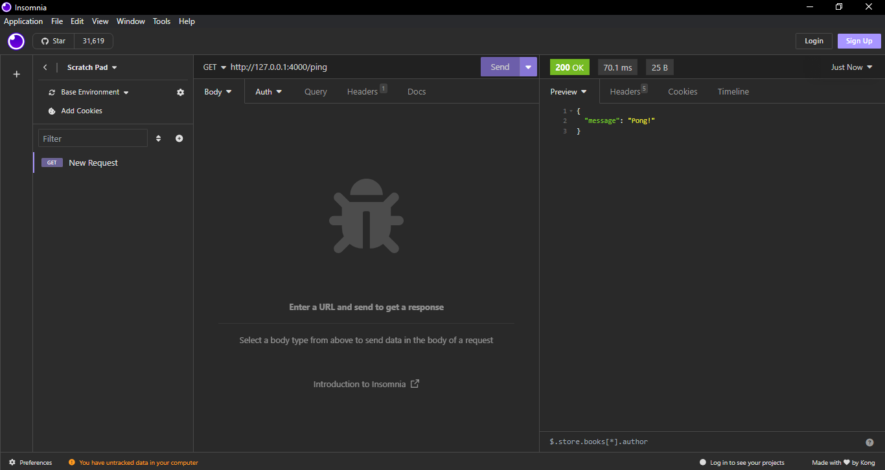

# Flask RESTAPI CRUD

## Introduction

This is a simple REST-API to handle users through CRUD operations. REST-API created with Flask and Python. A JSON file was used as a little database.

## How to run this?

First, you need to install the requirements:

```bash
$ pip install -r requirements.txt
```

then, you need to position yourself inside the project folder and run:

```bash
python app.py
```

In this project, pipenv was used to manage the virtual environment.

## Note

This project was based on one of the many videos from YouTube channel called [Fazt Code](https://youtu.be/Esdj9wlBOaI?si=HIQPQXahM7DJUZRy), a greate YouTube Channel related to the world of programming.

## Previews

Testing the REST-API



Empty databse


Creating the first user (Omitting age, because it's and optional field)


Creating the second user (with all fields filled out)


Some data


Searching for specific user


Searching for a non-existent user


Modifying an user (you can edit one or all of its fields)


Deleting an user


Final result

